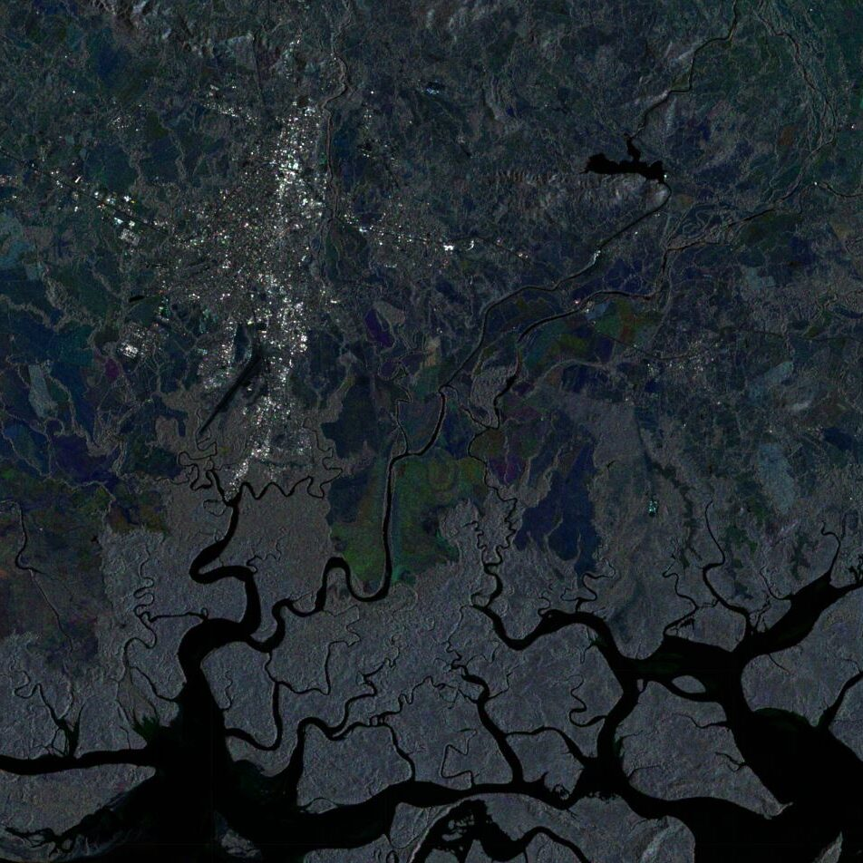

#*About this blog*

  

  <i>  This blog is composed of small geospatial analyses, which I have done, primarily tackling questions about environmental phenomena. Most of the examples are written in the JavaScript language for the Google Earth Engine interface. Examples in Python, and the Julia language will also be incorporated over time.</i>
  

  

    
  

 
# Blogs

{{ blog_content }}