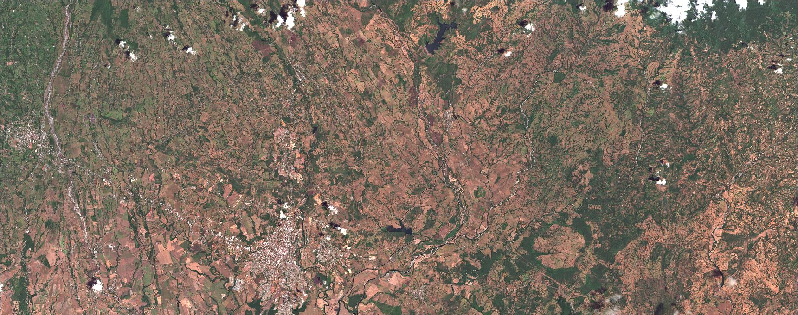

<h1 align="center">About me</h1>

  

  <i>
<b>Hello, I am Roger Almengor González, an environmental science professional specializing in remote sensing and geographic information sciences. My technical skills include database management, design, and execution, as well as programming in Python, Julia, and C. I am currently learning Rust. I have experience managing forestry projects, including mixed-species reforestation in my home country.

In my free time, I enjoy learning about geopolitics, playing musical instruments, and hiking in the Alps on the Germany-Austria border.

For more detailed information about my professional experience, please download my updated CV from the following link.

</i>
 
 
  

  

    
    
A satellite image of my hometown, David, Chiriquí, a place that holds a special spot in my heart, and one that I dearly miss.

  

 