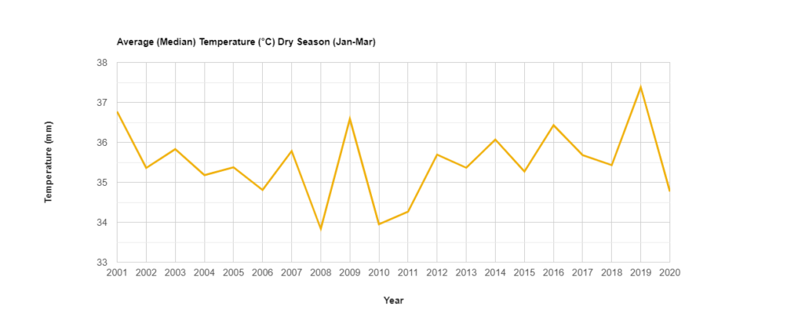
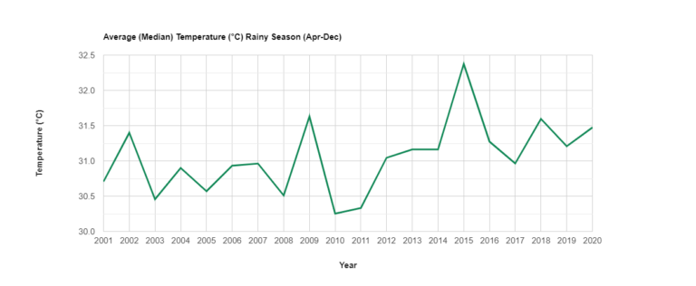

# Javascript

Welcome to the "JavaScript" section of this documentation. This section is dedicated to providing a solution-based approach to various geospatial analytics problems, complete with code explanations and illustrative outputs. The code presented here is based on the concepts and functionalities offered by the Google Earth Engine (GEE) JavaScript API.

If you are unfamiliar with the GEE JavaScript API or need further information on its usage and capabilities, you can refer to the official [Google Earth Engine JavaScript API documentation](https://developers.google.com/earth-engine/). This documentation serves as a valuable resource for understanding the core functionalities of the GEE platform and its JavaScript API, which form the foundation for the solutions and projects presented in this section. 

Feel free to explore the projects and code examples provided here to gain insights into how GEE can be leveraged for various geospatial analysis tasks.

## Time Lapse (Landsat Images)
Time lapse animations, are an interesting tool used to visualize changes on the earth
surface over time. The following animation is created by the code provided, and shows the changes over a 20 years period of time by the construction of a river dam in the province of Chiriqui, Republic of Panamá.

<p align="center">
  
  <br>
  <i>Time Lapse of Landsat Images from the Google Earth Engine platform.</i>
</p>


<details>
  <summary>Code</summary>
```javascript title="time_lapse.js" linenums="1"

/*******************************************************************************
 * Downloading Image Chips for Hidroelectrica dos Mares
 * Location: El Valle de Las Lomas, Chiriquí, Panamá
 * Author: Roger Almengor González
 * Data 26.09.2022
 * Project: CAP 2022
 * Land: Bayern
 * ****************************************************************************/

 // Feature Collection 
 var municipalities = ee.List(['Bijagual', 'Chiriquí', 'Cochea', 'David',
                            'Las Lomas','Gualaca', 'Rincón', 'Paja de Sombrero', 'Caldera', 'Dos Ríos', 'Los Anastacios', 'Dolega', 'Pedregal', 'San Pablo Viejo', 'San Pablo Nuevo', 
                            'San Carlos', 'Hornito', 'Tinajas'])

var AOI = table.filter(ee.Filter.inList('NAME_3', municipalities));
var municipalities = AOI.filter(ee.Filter.eq('NAME_1', 'Chiriquí'));
var district_list = ee.List(['Gualaca', 'Boquete', 'Dolega', 'David'])
var municipalities = municipalities.filter(ee.Filter.inList('NAME_2', district_list))
print(AOI);
Map.addLayer(municipalities);

var cochea_district = table.filter(ee.Filter.eq('NAME_3', 'Chiriquí'))
var centroid_cochea_coor = cochea_district.geometry().centroid()
                            .coordinates().getInfo()
var x = centroid_cochea_coor[0];
var y = centroid_cochea_coor[1];
print(x); 
print(y);
Map.setCenter(x, y, 12);


// Elaborating the dates
// Getting Temperatures for Every Month
var period = ['-01-01', '-12-01']; 

var years = [['1999', '2000'],
['2000', '2001'],
['2001', '2002'],
['2002', '2003'],
['2003', '2004'],
['2004', '2005'],
['2005', '2006'],
['2006', '2007'],
['2007', '2008'],
['2008', '2009'], 
['2009', '2010'], 
['2010', '2011'],
['2011', '2012'],
['2012', '2013'],
['2013', '2014'],
];

var add_period = function(year){
var start_date = period[0]; 
var end_date = period[1];
return [year[0] + start_date, year[1] + end_date];
};

var visualization = {
bands: ['SR_B4', 'SR_B3', 'SR_B2'],
min: 0.0,
max: 0.4,
};

var visualization_ = {
bands: ['SR_B4_median', 'SR_B3_median', 'SR_B2_median'],
min: 0.0,
max: 0.4,
};

var concatenate_year_with_periods = function(years, period){
return years.map(add_period);
};

var Dates = concatenate_year_with_periods(years, period);

print(Dates);

/***********************************************************************
   Landsat 5
************************************************************************/
// Applies scaling factors.
function applyScaleFactors(image) {
var opticalBands = image.select('SR_B.').multiply(0.0000275).add(-0.2);
var thermalBand = image.select('ST_B6').multiply(0.00341802).add(149.0);
return image.addBands(opticalBands, null, true)
.addBands(thermalBand, null, true);
}

var dataset = ee.ImageCollection('LANDSAT/LT05/C02/T1_L2')
.filterDate('1999-01-01', '2020-12-31')
.filterBounds(municipalities)
.map(applyScaleFactors)
.map(function(image){return image.clip(municipalities)});
/*******************************************************************************
* Downloading Image Chips for Hidroelectrica dos Mares
* Location: El Valle de Las Lomas, Chiriquí, Panamá
* Author: Roger Almengor González
* Data 26.09.2022
* Project: CAP 2022
* Land: Panama
* *****************************************************************************/

// Feature Collection 
//var municipalities = ee.List(['Bijagual', 'Chiriquí', 'Cochea', 'David',
// 'Las Lomas','Gualaca', 'Rincón',
//'Paja de Sombrero', 'Caldera', 'Dos Ríos', 'Los Anastacios', 'Dolega', 
//'Pedregal', 'San Pablo Viejo', 'San Pablo Nuevo', 'San Carlos', 'Hornito', 
// 'Tinajas'])

// Feature Collection 
var municipalities = ee.List(['Bijagual','Cochea','Las Lomas'])
var AOI = table.filter(ee.Filter.inList('NAME_3', municipalities));
var municipalities = AOI.filter(ee.Filter.eq('NAME_1', 'Chiriquí'));
var district_list = ee.List(['Gualaca', 'Boquete', 'Dolega', 'David'])
var municipalities = municipalities.filter(ee.Filter.inList('NAME_2', 
                                        district_list))
// Gets the bounds and create geometry
var extent = municipalities.geometry().bounds();
var buffered_extent = extent.buffer(ee.Number(10000)
                                    .sqrt()
                                    .divide(2), 1)
                                    .bounds();
//var municipalities = geometry
Map.addLayer(municipalities);

var cochea_district = table.filter(ee.Filter.eq('NAME_3', 'Bijagual'))
var centroid_cochea_coor = cochea_district.geometry()
                                            .centroid()
                                            .coordinates()
                                            .getInfo()

var x = centroid_cochea_coor[0];
var y = centroid_cochea_coor[1];
Map.setCenter(x, y, 10);


// Elaborating the dates
// Getting Temperatures for Every Month
var period = ['-01-01', '-12-01']; 

var years = [['1999', '2000'],
['2000', '2001'],
['2001', '2002'],
['2002', '2003'],
['2003', '2004'],
['2004', '2005'],
['2005', '2006'],
['2006', '2007'],
['2007', '2008'],
['2008', '2009'], 
['2009', '2010'], 
['2010', '2011'],
['2011', '2012'],
['2012', '2013'],
['2013', '2014'],
];

var add_period = function(year){
var start_date = period[0]; 
var end_date = period[1];
return [year[0] + start_date, year[1] + end_date];
};

var visualization = {
bands: ['SR_B4', 'SR_B3', 'SR_B2'],
min: 0.0,
max: 0.4,
};

var visualization_ = {
bands: ['SR_B4_median', 'SR_B3_median', 'SR_B2_median'],
min: 0.0,
max: 0.4,
};

var concatenate_year_with_periods = function(years, period){
return years.map(add_period);
};

var Dates = concatenate_year_with_periods(years, period);


/**********************************************************************
    Landsat 7 
***********************************************************************/
var visualization = {
bands: ['B4', 'B3', 'B2'],
min: 0.0,
max: 0.3,
};

var visualization_ = {
bands: ['B4_median', 'B3_median', 'B2_median'],
min: 0.0,
max: 0.5,
gamma: [0.95, 1.1, 1]
};

// Applies scaling factors.
var cloudMaskL7 = function(image) {
var qa = image.select('BQA');
var cloud = qa.bitwiseAnd(1 << 4)
.and(qa.bitwiseAnd(1 << 6))
.or(qa.bitwiseAnd(1 << 8));
var mask2 = image.mask().reduce(ee.Reducer.min());
return image
//.select(['B3', 'B4'], ['Red', 'NIR'])
.updateMask(cloud.not()).updateMask(mask2)
.set('system:time_start', image.get('system:time_start'));
};

var dataset = ee.ImageCollection('LANDSAT/LE07/C01/T1_TOA')
.filterDate('1999-01-01', '2020-12-31')
.filterBounds(AOI)
//.map(applyScaleFactors)
.map(cloudMaskL7)
.map(function(image){return image.clip(municipalities)});

//dataset = dataset.map(applyScaleFactors);

// Creating composites using median pixel value
var median_yearly_landsat_7 = function(start, end){
var dataset_ =  dataset.filter(ee.Filter.date(start, end));
var median_yearly = dataset_.reduce(ee.Reducer.median());
return median_yearly;
};

var composite_name_list_l7 = ee.List([]);

var apply_monthly_composite = function(date_list){
var start = date_list[0];
var end = date_list[1]; 
var output_name = start + "TO" + end + "_LANSAT_7";
var composite = median_yearly_landsat_7(start, end);
composite_name_list_l7 = composite_name_list_l7.add([composite, output_name]);
Map.addLayer(composite, visualization_, output_name, false);
Export.image.toDrive({
image: composite,
description: output_name,
fileFormat: 'GeoTIFF',
crs : 'EPSG:4326',
folder : 'LANDSAT_LST_LAS_LOMAS',
region: municipalities
});
return 0; 
};

Dates.map(apply_monthly_composite); 


/******************************************************************
// Animation gif 
// Create RGB visualization images for use as animation frames.
/******************************************************************/
var text = require('users/gena/packages:text');
var annotated_collection_list = ee.List([])
var annotations = [
{position: 'left', 
offset: '0.25%', 
margin: '0.25%', 
property: 'label', 
scale: 250} //large scale because image if of the whole world. Use smaller scale
];

var create_annotated_collection = function(image_and_id) {
var img = image_and_id[0];
var image_id = image_and_id[1];
print(image_id);
var img_out = img.visualize(visualization_)
//.clip(geometry)//.paint(municipalities, 'FF0000', 2)
.set({'label': image_id});
Map.addLayer(img_out);
var annotated = text.annotateImage(img_out, {}, Bayern, annotations);
annotated_collection.add(annotated);
return 0;
};

var municipalities_geom = geometry;
var n = composite_name_list_l7.size().getInfo();
print(n);
for (var i = 0; i < n; i++) {
var img_info = ee.List(composite_name_list_l7.get(i));
print(img_info);
var img = ee.Image(img_info.get(0));
var img_id = ee.String(img_info.get(1));
var year = ee.String(ee.List(img_id.split("-").get(0)));
var month = ee.String(ee.List(img_id.split("-").get(1)));
var img_id_ = year.getInfo() // + "_" + month.getInfo();
var img_out = img.visualize(visualization_)
//.paint(geometry, 'FF0000', 2)
.set({'label': img_id_});
var annotated = text.annotateImage(img_out, {}, buffered_extent, annotations);
Map.addLayer(annotated);
var annotated_collection_list = annotated_collection_list.add(annotated)
}

var annotated_col = ee.ImageCollection(annotated_collection_list)

// Define GIF visualization parameters.
var gifParams = {
'region': buffered_extent,
'dimensions': 508,
//'crs': 'EPSG:32632',
'framesPerSecond': 1
};

// Print the GIF URL to the console.
print(annotated_col.getVideoThumbURL(gifParams));
// Render the GIF animation in the console.
print(ui.Thumbnail(annotated_col, gifParams));
```
</details>

## Measuring land surface temperature with MODIS data


**Script Description:**
This script is designed to analyze temperature changes within the Cochea River watershed using the Google Earth Engine (GEE) platform and MODIS (Moderate Resolution Imaging Spectroradiometer) datasets. Specifically, it focuses on measuring temperature variations during both the rainy and dry seasons over a 20-year period. The primary objectives of this script are to generate an animated GIF, a time series graph depicting the Average Median Temperature (°C) as recorded by the MODIS sensor, and a regional overview of the study area.

**Script Workflow:**
1. **Data Acquisition:** The script begins by accessing MODIS datasets, which provide reliable temperature data with global coverage and high temporal resolution.

2. **Temporal Selection:** It then filters the MODIS data to isolate the specific time periods corresponding to the dry and wet seasons over the 20-year span.

3. **Spatial Region Selection:** The script defines the study area within the Cochea River watershed, ensuring that the analysis is limited to the relevant geographic scope.

4. **Temperature Computation:** Using the MODIS temperature data, the script calculates the Average Median Temperature (°C) for each pixel within the study area, both for the dry and wet seasons.

5. **Visualization Generation:**
   - *Animated GIF:* The script generates an animated GIF, showcasing the temporal evolution of temperature changes over the 20-year period. Each frame of the GIF represents a specific time step, offering a dynamic visual representation of temperature variations.
    <p align="center">
      
      <br>
    <i>Time Lapse of MODIS Land Surface Temperature (Dry Season) from the Google Earth Engine platform.</i>
    </p>
    <br>
    <p align="center">
      
      <br>
    <i>Time Lapse of MODIS Land Surface Temperature (Rainy Season) from the Google Earth Engine platform.</i>
    </p>
    <br>
   
   - *Time Series Graph:* Additionally, the script creates a time series graph, displaying the Average Median Temperature (°C) as a function of time. This graph provides a clear overview of temperature trends during the dry and wet seasons.
    <p align="center">
      
      <br>
      <i>Average median temperature for the Dry Season measured from MODIS time series.</i>
      </p>
    <br>

    <p align="center">
      
      <br>
      <i>Average median temperature for the Wet Season measured from MODIS time series.</i>
      </p>
    <br>

   
   - *Regional View:* Lastly, the script produces a regional view of the study area, allowing users to geospatially contextualize the temperature changes observed in the Cochea River watershed.

By following this technical script, users can conduct a rigorous analysis of temperature fluctuations within the specified region and timeframes, enabling in-depth insights into environmental changes over the 20-year period.

<details>
  <summary>Code</summary>
```javascript title="land_surface_MODIS.js" linenums="1"
// Feature Collection 
var districts = ee.List(['Bijagual','Cochea','Las Lomas'])
var AOI = table.filter(ee.Filter.inList('NAME_3', districts));
var districts = AOI.filter(ee.Filter.eq('NAME_1', 'Chiriquí'));
Map.addLayer(districts.union())

// Setting the Map to the coordinates of one of our districts
var cochea_district = table.filter(ee.Filter.eq('NAME_3', 'Bijagual'));
var centroid_cochea_coor = cochea_district.geometry().centroid().coordinates().getInfo();
var x = centroid_cochea_coor[0];
var y = centroid_cochea_coor[1];
Map.setCenter(x, y, 10);

// Raster Visualization Parameters
var landSurfaceTemperatureVis = {
  min: 0, max: 40,
  palette: ['blue', 'limegreen', 'yellow', 'darkorange', 'red']};

  // Image Collection MODIS Surface Temperature Median Values 
// (Dry Season January - March)
// (Wet Season April - December)
var startYear = 2001;
var endYear = 2020;
var DrySeasonMedianCollection = ee.ImageCollection(
  ee.List.sequence(startYear, endYear)
    .map(createDrySeasonMedianComposite)
);

var WetSeasonMedianCollection = ee.ImageCollection( 
  ee.List.sequence(startYear, endYear)
  .map(createWetSeasonMedianComposite)
);

function createDrySeasonMedianComposite(year) {
var startDate = ee.Date.fromYMD(year, 1, 1);
var endDate = ee.Date.fromYMD(year, 3, 31);
var description = startDate.format('yyyy-MM-dd')
.cat(' TO ')
.cat(endDate.format('yyyy-MM-dd'));
return ee.ImageCollection('MODIS/061/MOD11A1')
.filterBounds(districts)
.filterDate(startDate, endDate)
.select('LST_Day_1km')
.map(function(img) {
return img
.multiply(0.02)
.subtract(273.15)
.copyProperties(img, ['system:time_start']);
})
.median()
.set('year', year)
.set('description', description);
}

function createWetSeasonMedianComposite(year) {
var startDate = ee.Date.fromYMD(year, 4, 1);
var endDate = ee.Date.fromYMD(year, 12, 31);
var description = startDate.format('yyyy-MM-dd')
.cat(' TO ')
.cat(endDate.format('yyyy-MM-dd'));
return ee.ImageCollection('MODIS/061/MOD11A1')
.filterBounds(districts)
.filterDate(startDate, endDate)
.select('LST_Day_1km')
.map(function(img) {
return img
.multiply(0.02)
.subtract(273.15)
.copyProperties(img, ['system:time_start']);
})
.median()
.set('year', year)
.set('description', description);
}

DrySeasonMedianMultiBandImg = DrySeasonMedianCollection
      .toBands()
      .select('[0-9]{1,2}_LST_Day_1km');

WetSeasonMedianMultiBandImg = WetSeasonMedianCollection
      .toBands()
      .select('[0-9]{1,2}_LST_Day_1km');

// Define a dictionary that associates band names with values 
var TempInfo = {
  '0_LST_Day_1km': {v: 1, f: '2001'},
  '1_LST_Day_1km': {v: 2, f: '2002'},
  '2_LST_Day_1km': {v: 3, f: '2003'},
  '3_LST_Day_1km': {v: 4, f: '2004'},
  '4_LST_Day_1km': {v: 5, f: '2005'},
  '5_LST_Day_1km': {v: 6, f: '2006'},
  '6_LST_Day_1km': {v: 7, f: '2007'},
  '7_LST_Day_1km': {v: 8, f: '2008'},
  '8_LST_Day_1km': {v: 9, f: '2009'},
  '9_LST_Day_1km': {v: 10, f: '2010'},
  '10_LST_Day_1km': {v: 11, f: '2011'},
  '11_LST_Day_1km': {v: 12, f: '2012'},
  '12_LST_Day_1km': {v: 13, f: '2013'},
  '13_LST_Day_1km': {v: 14, f: '2014'},
  '14_LST_Day_1km': {v: 15, f: '2015'},
  '15_LST_Day_1km': {v: 16, f: '2016'},
  '16_LST_Day_1km': {v: 17, f: '2017'},
  '17_LST_Day_1km': {v: 18, f: '2018'},
  '18_LST_Day_1km': {v: 19, f: '2019'},
  '19_LST_Day_1km': {v: 20, f: '2020'},
}

var xPropVals = [];
var xPropLabels = [];

for (var key in TempInfo){
  xPropVals.push(TempInfo[key].v);
  xPropLabels.push(TempInfo[key]);
}

// Apply the dissolve method to the Geometry object.
print(districts)
var geometryDissolve = districts.union();

// Define the chart and print it to the console.
var chartDrySeason = ui.Chart.image
                .regions({
                  image: DrySeasonMedianMultiBandImg,
                  regions: districts.union(),
                  reducer: ee.Reducer.mean(),
                  scale: 500,
                  seriesProperty: 'label',
                  xLabels: xPropVals
                })
                .setChartType('LineChart')
                .setOptions({
                  title: 'Average (Median) Temperature (°C) Dry Season (Jan-Mar)',
                  hAxis: {
                    title: 'Year',
                    titleTextStyle: {italic: false, bold: true},
                    ticks: xPropLabels
                  },
                  vAxis: {
                    title: 'Temperature (°C)',
                    titleTextStyle: {italic: false, bold: true}
                  },
                  colors: ['f0af07', '0f8755', '76b349'],
                  lineSize: 3
});
print(chartDrySeason);

// Define the chart and print it to the console.
var chartWetSeason = ui.Chart.image
                .regions({
                  image: WetSeasonMedianMultiBandImg ,
                  regions: districts.union(),
                  reducer: ee.Reducer.mean(),
                  scale: 500,
                  seriesProperty: 'label',
                  xLabels: xPropVals
                })
                .setChartType('LineChart')
                .setOptions({
                  title: 'Average (Median) Temperature (°C) Rainy Season (Apr-Dec)',
                  hAxis: {
                    title: 'Year',
                    titleTextStyle: {italic: false, bold: true},
                    ticks: xPropLabels
                  },
                  vAxis: {
                    title: 'Temperature (°C)',
                    titleTextStyle: {italic: false, bold: true}
                  },
                  colors: ['0f8755', '76b349'],
                  lineSize: 3
});
print(chartWetSeason);

// Define GIF visualization parameters.
var gifParams = {
  'region': buffered_extent,
  'dimensions': 600,
  'framesPerSecond': 1.5
};

var text = require('users/gena/packages:text'); // Import gena's package which allows text overlay on image

var annotations = [
 {position: 'left', offset: '0.25%', margin: '0.25%', property: 'label', scale: 100} //large scale because image if of the whole world. Use smaller scale otherwise
  ];

function addText(image){
  var image_0 = image.clip(districts.union());
  var timeStamp = image.get('description'); // get the time stamp of each frame. This can be any string. Date, Years, Hours, etc.
  var timeStamp_ = ee.String(timeStamp); //convert time stamp to string 
  var image_ = image_0.visualize(landSurfaceTemperatureVis).set({'label':timeStamp}); // set a property called label for each image
  var annotated = text.annotateImage(image_, {}, extent, annotations); // create a new image with the label overlayed using gena's package
  return annotated;
}

var AnnotatedCollectionWetSeason = WetSeasonMedianCollection.map(addText); //add time stamp to all images
var AnnotatedCollectionDrySeason = DrySeasonMedianCollection.map(addText);

  
print(ui.Thumbnail(AnnotatedCollectionWetSeason,  gifParams));

var AnnotatedCollectionDrySeason = DrySeasonMedianCollection.map(addText);

print(ui.Thumbnail(AnnotatedCollectionDrySeason,  gifParams));

// ui.Map objects can be constructed. Here, a new map is declared.
var newMap = ui.Map({
  center: {lat: 8, lon: -80, zoom: 5.5
  },
  style: {position: 'bottom-right', width: '400px'}
});

var geomLayer = ui.Map.Layer(districts.union(), {color: 'red'}, 'Area of Interest');
var extentLayer = ui.Map.Layer(districts.bounds, {color:'red'}, 'Extent');
newMap.add(geomLayer);
newMap.add(extentLayer);

// Add the newMap to the defaultMap;
Map.add(newMap);

// Other UI widgets can be added to ui.Map objects, for example labels:
defaultMap.add(ui.Label('Countrywide location', {position: 'bottom-left'}));
newMap.add(ui.Label('Regional Location', {position: 'bottom-left'}));

Map.setControlVisibility({all: false});
newMap.setControlVisibility({all: false});
Map.setOptions("SATELLITE");

```
</details>