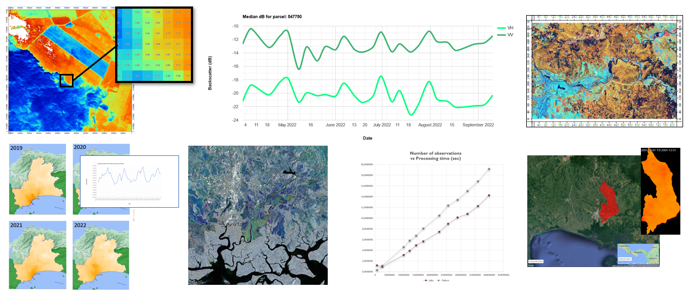

# Description 

      
       

My portfolio comprises a collection of functions and algorithms designed to assist geospatial developers in solving common problems encountered in geospatial analysis. This portfolio provides implementations of these solutions in the programming languages, including Python, Julia, and Geoogle Earth Engine Java Script API. The examples can be modified to fit the requirements of your geospatial solutions.

**Author** 
Roger Almengor González

**Contact and website** 
rogeralmengor@gmail.com 
https://rogeralmengor.github.io/geospatial-analysis.io/ 